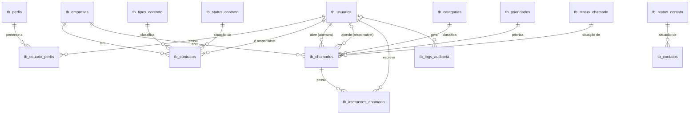

# Banco de Dados

Arquivo: `Banco/banco.sql`. Banco: `onion_systems` (utf8mb4, InnoDB).
Requer MySQL 8.0.16+ ou MariaDB 10.5+ por causa das restrições `CHECK`.

O script pode ser executado várias vezes: ele remove views e tabelas na ordem correta (filhas antes das pais) e recria tudo.

## Tabelas

**Cadastro (sem dependências)**

| Tabela | Finalidade |
|---|---|
| `tb_usuarios` | Usuários internos do sistema (senha armazenada como hash) |
| `tb_perfis` | Perfis de acesso: Administrador, Gestor, Técnico, Atendente |
| `tb_empresas` | Empresas clientes da Onion Systems |
| `tb_tipos_contrato` | Desenvolvimento, Suporte, Consultoria, Infraestrutura, Licenciamento, Manutenção |
| `tb_status_contrato` | Ativo, Pendente, Encerrado, Cancelado, Renovação |
| `tb_categorias` | Categorias de chamado (Hardware, Software, Rede...) |
| `tb_prioridades` | Baixa (1), Média (2), Alta (3), Urgente (4) |
| `tb_status_chamado` | Aberto, Em atendimento, Aguardando cliente, Resolvido, Fechado, Cancelado |
| `tb_status_contato` | Novo, Em atendimento, Respondido, Arquivado |

**Relacionamento**

| Tabela | Finalidade |
|---|---|
| `tb_usuario_perfis` | Liga usuários e perfis (N:N). Chave primária composta |

**Principais**

| Tabela | Finalidade |
|---|---|
| `tb_contratos` | Contratos das empresas, com responsável, tipo, status, vigência e alerta de renovação |
| `tb_chamados` | Chamados de suporte, com quem abriu e quem responde |
| `tb_contatos` | Mensagens do formulário público do site |

**Histórico e auditoria**

| Tabela | Finalidade |
|---|---|
| `tb_interacoes_chamado` | Mensagens trocadas durante o atendimento de um chamado |
| `tb_logs_auditoria` | Registro de ações (INSERT, UPDATE, DELETE, LOGIN, LOGOUT) |

## Diagrama



`tb_logs_auditoria` não possui chave estrangeira em `tabela` e `id_registro`, de propósito: um mesmo log precisa apontar para registros de várias tabelas diferentes.

## Regras de integridade

**Chaves estrangeiras**

- A maioria usa `ON DELETE RESTRICT`: não é possível apagar empresa, usuário, tipo ou status que ainda estejam em uso.
- `ON DELETE CASCADE`: `tb_usuario_perfis` (some junto com o usuário ou o perfil) e `tb_interacoes_chamado` (some junto com o chamado).
- `ON DELETE SET NULL`: `id_usuario_responsavel` em `tb_chamados` e `id_usuario` em `tb_logs_auditoria`. O chamado e o log continuam existindo.

**Restrições `CHECK`**

| Tabela | Regra |
|---|---|
| `tb_empresas` | CNPJ com 14 caracteres; CEP, quando informado, com 8 |
| `tb_contratos` | `data_fim >= data_inicio`; `valor >= 0`; `dias_alerta_renovacao` entre 1 e 365 |
| `tb_chamados` | `data_fechamento` nula ou não anterior a `data_abertura`; título com pelo menos 3 caracteres |
| `tb_logs_auditoria` | `acao` somente INSERT, UPDATE, DELETE, LOGIN ou LOGOUT |

**Valores únicos:** e-mail do usuário; CNPJ da empresa; nome em todas as tabelas de status, tipos, categorias, prioridades e perfis; `nivel` das prioridades; par `(id_empresa, numero_contrato)` nos contratos (cada empresa pode ter seu próprio contrato "001").

O banco confere apenas o **formato** do CNPJ e do CEP (quantidade de caracteres). A validação do CNPJ e a do e-mail devem ser feitas pela aplicação.

## Índices

As chaves estrangeiras já geram índices automaticamente. Os índices extras atendem consultas do painel e do back-end:

| Índice | Atende |
|---|---|
| `idx_contratos_data_fim` | Contratos próximos do vencimento |
| `idx_contratos_status_data_fim` | Contratos por status e vencimento |
| `idx_chamados_empresa_status` | Chamados de uma empresa por status |
| `idx_chamados_responsavel_status` | Fila de um responsável |
| `idx_chamados_data_abertura` | Ordenação por data |
| `idx_interacoes_chamado_data` | Histórico do chamado em ordem cronológica |
| `idx_logs_tabela_registro` | Auditoria de um registro específico |
| `idx_logs_data_hora` | Auditoria por período |
| `idx_usuario_perfis_perfil` | Usuários de um perfil |
| `idx_contatos_status` | Filtro de contatos por status |
| `idx_contatos_email_data` | Limite de envios e duplicidade do formulário de contato |

## Views

- **`vw_contratos_completos`**: contrato com empresa, responsável, tipo e status, mais o campo calculado `dias_para_vencimento` (negativo = já venceu).
- **`vw_chamados_completos`**: chamado com empresa, quem abriu, responsável (pode ser nulo), categoria, prioridade e status.

Exemplo, contratos ativos que vencem nos próximos 30 dias:

```sql
SELECT *
FROM vw_contratos_completos
WHERE dias_para_vencimento BETWEEN 0 AND 30
  AND status_contrato = 'Ativo';
```

## Dados iniciais

O script já insere perfis, tipos de contrato, status (de contrato, chamado e contato), categorias e prioridades, além de um contato de teste. **Nenhum usuário é criado:** a senha precisa ser gerada com `password_hash()` no PHP. Remova o contato de teste antes de ir para produção.
